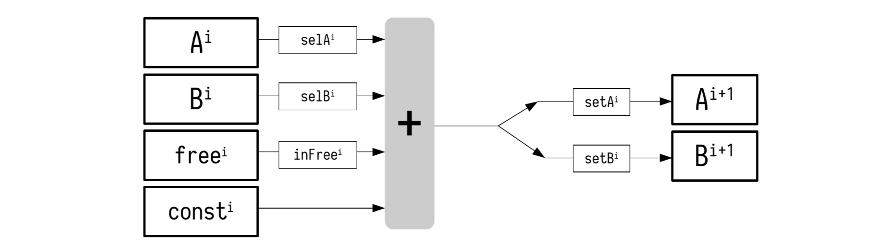

Next we show the arithmetization process of a more complex but yet simple state machine. Unlike the Fibonacci state machine, our simple state machine transitions from one state to the next in response to certain external instructions. See Figure 1 below, for such a state machine, with registries $\texttt{A}$ and $\texttt{B}$, and a state $\big(\texttt{A}^{\texttt{i}},\texttt{B}^{\texttt{i}}\big)$ that changes to another state $\big(\texttt{A}^{\texttt{i+2}},\texttt{B}^{\texttt{i+2}}\big)$ in accordance to two instructions, $\texttt{Instruction}^{\texttt{i}}$ and $\texttt{Instruction}^{\texttt{i+1}}$.

<b>  Figure 1: A State Machine Receiving Instructions </b>

In the context of the zkProver, these instructions are written as zk-Assembly (zkASM) codes, and stored in a ROM in JSON-format.

### State Machine Instructions

Suppose the above simple state machine receives an input, together with the following execution instruction, $\texttt{Instruction}^{\texttt{1}}$, written in Assembly.

<b> Table 1: Instruction^1 written in zk-Assembly </b>

$$\begin{array}{|l|c|}
\hline
\texttt{ } & \texttt{Instruction}^{\texttt{1}} \\ \hline
\texttt{line 1} & \mathtt{\$\{getInput()\} => A}\\ \hline
\texttt{line 2} & \mathtt{3 => B} \\ \hline
\texttt{line 3} & \mathtt{:ADD} \\ \hline
\texttt{line 4} & \mathtt{0 => A,B} \\ \hline
\end{array}$$

In accordance with each line of $\texttt{Instruction}^{\texttt{1}}$, the state machine executor must;

- $\texttt{line 1}$: Get a free input value and move it into register $\texttt{A}$.
- $\texttt{line 2}$: Move the value $\mathtt{3}$ into register $\mathtt{B}$.
- $\texttt{line 3}$: Compute the sum of registry values $\mathtt{A}$ and $\mathtt{B}$, and save the output into register $\mathtt{A}$.
- $\texttt{line 4}$: Set the registers $\mathtt{A}$ and $\mathtt{B}$ to the value $\mathtt{0}$.

For a free input value of $7$, the corresponding state transitions can be recorded in a table as follows;

<b> Table 2: Record of all State Changes </b>

$$\begin{array}{|l|c|c|c|c|c|c|}
\hline
\texttt{ } & \texttt{Instruction}^{\texttt{1}} & \mathtt{free} & \mathtt{A} & \mathtt{A'} & \mathtt{B} & \mathtt{B'} \\ \hline
\texttt{line 1} & \mathtt{\$\{getInput()\} => A} & 7 & 0 & 7 & 0 & 0 \\ \hline
\texttt{line 2} & \mathtt{3 => B} & 0 & 7 & 7 & 0 & 3 \\ \hline
\texttt{line 3} & \mathtt{:ADD} & 0 & 7 & 10 & 3 & 3 \\ \hline
\texttt{line 4} & \mathtt{0 => A,B} & 0 & 10 & 0 & 3 & 0 \\ \hline
\end{array}$$

Note that $\mathtt{A'}$ and $\mathtt{B'}$ denote the next state of the registers $\mathtt{A}$ and $\mathtt{B}$, respectively. 

Observe also that, each line of $\texttt{Instruction}^{\texttt{1}}$ does not always affect all register values. Since every register is initialised to $\mathtt{0}$ at the start, the state transitions are such that,

- $\texttt{line 1}$ only affects two registers; $\mathtt{free}$ and $\mathtt{A'}$.
- $\texttt{line 2}$ affects the register $\mathtt{B'}$ alone. Any other state change is due to the rules and the logic of the state machine (i.e., changes in registers; $\mathtt{free}$ and $\mathtt{A}$).
- $\texttt{line 3}$ affects the register $\mathtt{A'}$ alone. Again, the state change in register $\mathtt{B}$ is due to the state machine's rules and logic.
- $\texttt{line 4}$ affects only two registers; $\mathtt{A'}$ and $\mathtt{B'}$. The state change in register $\mathtt{A}$ is also due to the rules and the logic of the state machine.

### Computational Trace

Recall that the intention with developing these state machines is not only to carry out computations, but to also ensure that correctness of these computations is verifiable. In addition, verification must be achievable even by users with modest computer power. That said, keeping record of computations, as seen in Table 2 above, is not preferable for verification purposes, because the registry values can be very large for some state machines. And thus, defeating the ultimate purpose and aim of our rollup.

One therefore needs a way to keep track of all the computations and their correct execution, without requiring excessive memory. This is achieved by utilising the computational trace.

For our verification purposes, the **computational trace** does not capture the actual state values of each state transition, but uses selectors and setters to keep record of whether registry values have been altered (during each state transition) in a way that tallies with the received instructions.

Like switches that can either be ON or OFF, selectors and setters can also be either $\mathtt{1}$ or $\mathtt{0}$.

Rule for the $\texttt{inFree}$ selector: Record $\texttt{inFree}$ as $\mathtt{1}$ only if the value of the register $\texttt{free}$ is non-zero.

Rule for selectors $\{\texttt{setX}\}$: Each selector $\texttt{setX}$ is recorded;

- As the value $\mathtt{1}$, if the value of the corresponding registry $\texttt{X}$ was involved in (or contributed to) the computation,
- Otherwise, $\texttt{selX}$ is recorded as the value $\mathtt{0}$.

Rule for setters $\{\texttt{setY}\}$: Each setter $\texttt{setY}$ is recorded;

- As the value $\mathtt{1}$, if the corresponding registry value $\texttt{Y}$ was altered by the instruction,
- Or, as the value $\mathtt{0}$, otherwise.

The computational trace therefore consists mostly of bits, instead of large registry values. 

In the zkEVM context, the computational trace is stored as a lookup table in the ROM of the relevant state machine.

#### Example (Computational Trace)

Take as an example, $\texttt{Instruction}^{\texttt{1}}$ above. Set selectors $\texttt{selA}$, $\texttt{selB}$ and $\texttt{inFree}$ for the registers $\texttt{A}$, $\texttt{B}$ and $\texttt{free}$, respectively. And, setters $\texttt{setA}$ and $\texttt{setB}$ for the registers $\mathtt{A'}$ and $\mathtt{B'}$, respectively. 

As discussed above;

- The register values, $\mathtt{free}$ and $\mathtt{A'}$, were changed in $\texttt{line 1}$. Therefore, only selector $\texttt{inFree}$ and setter $\texttt{setA}$ are recorded as $\mathtt{1}$.
- The register values  $\mathtt{B'}$, $\mathtt{free}$ and $\mathtt{A}$ were changed in $\texttt{line 2}$. But, only setter $\texttt{setB}$ is recorded as $\mathtt{1}$ because it is the only change the instruction effected.
- The register values $\mathtt{A'}$ and $\mathtt{B}$ were changed in $\texttt{line 3}$. So, setter $\texttt{setA}$ is recorded as $\mathtt{1}$. But since register values $\texttt{A}$ and $\texttt{B}$ were involved in the computation in $\texttt{line 3}$, they are also recorded as $\mathtt{1}$. 
-  The register values  $\mathtt{A'}$, $\mathtt{B'}$ and $\mathtt{A}$ were changed in $\texttt{line 4}$. Consequently, only setters $\texttt{setA}$ and $\texttt{setB}$ are recorded as $\mathtt{1}$.

The computational trace after executing $\texttt{Instruction}^{\texttt{1}}$ is as reflected in Table 3 below.

  

<b> Table 3: Computational Trace for Instruction^1 </b>

$$\begin{array}{|l|c|c|c|c|c|c|c|c|c|c|c|}
\hline
\texttt{ } & \texttt{Instruction}^{\texttt{1}} & \mathtt{free} & \texttt{setB} & \texttt{setA} & \texttt{inFree} & \texttt{selB} & \texttt{selA} & \mathtt{A} & \mathtt{A'} & \mathtt{B} & \mathtt{B'} \\ \hline
\texttt{line 1} & \mathtt{\$\{getInput()\} => A} & 7 & 0 & 1 & 1 & 0 & 0 & 0 & 7 & 0 & 0 \\ \hline
\texttt{line 2} & \mathtt{3 => B} & 0 & 1 & 0 & 0 & 0 & 0 & 7 & 7 & 0 & 3 \\ \hline
\texttt{line 3} & \mathtt{:ADD} & 0 & 0 & 1 & 0 & 1 & 1 & 7 & 10 & 3 & 3 \\ \hline
\texttt{line 4} & \mathtt{0 => A,B} & 0 & 1 & 1 & 0 & 0 & 0 & 10 & 0 & 3 & 0 \\ \hline
\end{array}$$

### Arithmetic Constraints

Next we create a proper set of arithmetic constraints required in proving correctness of execution. Similar to the Fibonacci SM, where each state had to conform to polynomial identities and each polynomial identity was nothing but an algebraic relation between two consecutive states, our executor SM also needs such algebraic relations. These algebraic relations are also called **arithmetic constraints**.

In order to fully express the relations between the next values of registries $\texttt{A}$ and $\texttt{B}$ as a linear combination of the current registry values, auxiliary registers and selectors need to be added.

This is shown in Figure 2 below, as an algebraic processor of sorts.

<b> Figure 2: The State Machine as an Algebraic Processor</b>

The notation used in Figure 2 is as follows,

a)  $\mathtt{inFree}^i \in \{0,1\}$ indicates whether $\mathtt{free^i}$ is included in the linear combination or not.

b)  $\mathtt{setX}^i \in \{0,1\}$ indicates whether the result of the linear combination was moved into $\mathtt{X^{i+1}}$ or not.

c) $\mathtt{freeIn}^i$ carries inputs freely chosen in order to execute the program.

d) $\mathtt{const}^i$ carries fixed values moved into specified registers as per instructions received.
$$
\text{ }
$$

Introducing new auxiliary registers results in the following extended table. 

$$
\begin{array}{|l|c|}
\hline
\texttt{ \ } & \texttt{Instruction}^{\texttt{1}}\\ \hline
\texttt{line 1} & \mathtt{\$\{getInput()\} => A}\\\hline
\texttt{line 2} & \mathtt{3 => B}\\\hline
\texttt{line 3} & \mathtt{:ADD}\\\hline
\texttt{line 4} & \mathtt{0 => A,B}\\\hline
\end{array}
\hspace{0.1cm}
\begin{array}{|c|c|c|c|c|c|c|c|}
\hline
\texttt{free} & \texttt{const} & \texttt{setB} & \texttt{setA} & \texttt{inFree} & \texttt{selB} & \texttt{selA}\\\hline
7 & 0 & 0 & 1 & 1 & 0 & 0\\\hline
0 & 3 & 1 & 0 & 0 & 0 & 0\\\hline
0 & 0 & 0 & 1 & 0 & 1 & 1\\\hline
0 & 0 & 1 & 1 & 0 & 0 & 0\\\hline
\end{array}
\hspace{0.1cm}
\begin{array}{|c|c|c|c|}
\hline
\mathtt{A} & \mathtt{A'} & \mathtt{B} & \mathtt{B'}\\\hline
0 & 7 & 0 & 0\\\hline
7 & 7 & 0 & 3\\\hline
7 & 10 & 3 & 3\\\hline
10 & 0 & 3 & 0\\\hline
\end{array}
$$

Henceforth, the relations between the states of the registries can be expressed algebraically as follows: 

$$\begin{aligned}
&\mathtt{A}^{i+1} = \mathtt{A}^i + \mathtt{setA}^i \cdot (\mathtt{selA}^i \cdot \mathtt{A}^i + \mathtt{selB}^i \cdot \mathtt{B^i} + \mathtt{inFree}^i \cdot \mathtt{free}^i + \mathtt{const}^i - \mathtt{A}^i), \\
&\mathtt{B}^{i+1} = \mathtt{B}^i + \mathtt{setB}^i \cdot (\mathtt{selA}^i \cdot \mathtt{A}^i + \mathtt{selB}^i \cdot \mathtt{B}^i + \mathtt{inFree}^i \cdot \mathtt{free}^i + \mathtt{const}^i - \mathtt{B}^i).\\
\end{aligned}$$

### Polynomial Constraints

Let's represent the states of these registries for four steps as polynomials $\mathtt{A}, \mathtt{B} \in \mathbb{Z}_p[x]$ evaluated on the subgroup $H = \{\omega, \omega^2, \omega^3, \omega^4 = 1\}$, in order to produce a cyclic relation:

$$\begin{aligned}
&\mathtt{A}(x\omega) = \mathtt{A}(x) + \mathtt{setA}(x) \cdot (\mathtt{selA}(x) \cdot \mathtt{A}(x) + \mathtt{selB}(x) \cdot \mathtt{B}(x) + \mathtt{inFree}(x) \cdot \mathtt{free}(x) + \mathtt{const}(x) - \mathtt{A}(x)), \\
&\mathtt{B}(x\omega) = \mathtt{B}(x) + \mathtt{setB}(x) \cdot (\mathtt{selA}(x) \cdot \mathtt{A}(x) + \mathtt{selB}(x) \cdot \mathtt{B}(x) + \mathtt{inFree}(x) \cdot \mathtt{free}(x) + \mathtt{const}(x) - \mathtt{B}(x)).
\end{aligned}$$

Observe that the program is completely described by the constant (and public) polynomials $\mathtt{selA(x)}$, $\mathtt{selB(x)}$, $\mathtt{setA(x)}$, $\mathtt{setB(x)}$, $\mathtt{inFree(x)}$ and $\mathtt{const(x)}$.

The polynomial $\mathtt{free}(x)$ can be public or committed and by changing this polynomial, we can proof different executions for different initial conditions for the same "program".

In our previous program, we can provide a result of the execution by giving $A(\omega^4)$.

Notice that the last instruction resets the states' values and "glues" the last instruction with the first one, achieving a cycle.

## Programs with Conditional Jumps

We are going to add the instruction $\mathtt{JMPZ}$ to our assembly. $\mathtt{JMPZ}$ jumps to a specified position in the program if the preceding state of the register $\mathtt{A}$ is zero. 

In the next program, $\mathtt{JMPZ}$ will jump to position $5$ if the previous result of $\mathtt{A + B}$ (which is actually stored in the register $\mathtt{A}$) is $0$: 

$$
\begin{array}{|c|l|}
\hline
\textbf{Position} & \texttt{Instruction} \\ \hline
0 & \mathtt{\$\{getInput()\} => A}  \\ \hline
1 & \mathtt{-3 => B} \\ \hline
2 & \mathtt{:ADD} \\ \hline
3 & \mathtt{:JMPZ(5)} \\ \hline 
4 & \mathtt{:ADD} \\ \hline
5 & \mathtt{0 => A, B} \\ \hline
\end{array}
$$

*Note: We will discuss later on how to introduce negative values into our program.*

In programs with conditional jumps, our previous model will not work, because the flow of the program may vary depending on the values of the input.

As it can be seen next, with conditional jumps, the length of the execution trace is **not constant** (it depends on the free input):

$$
\begin{array}{|l|c|c|c|c|c|}
\hline
\texttt{Instruction} & \mathtt{free} & \mathtt{A} & \mathtt{A'} & \mathtt{B} & \mathtt{B'} \\ \hline
\mathtt{\$\{getInput()\} => A} & 7 & 0 & 7 & 0 & 0 \\ \hline
\mathtt{-3 => B} & 0 & 7 & 7 & 0 & -3 \\ \hline
\mathtt{:ADD} & 0 & 7 & 4 & -3 & -3 \\ \hline
\mathtt{:JMPZ(5)} & 0 & 4 & 4 & -3 & -3 \\ \hline
\mathtt{:ADD} & 0 & 4 & 1 & -3 & -3 \\ \hline
\mathtt{0 => A, B} & 0 & 1 & 0 & -3 & 0 \\ \hline
\end{array}
$$

$$
\begin{array}{|l|c|c|c|c|c|}
\hline
\texttt{Instruction} & \mathtt{free} & \mathtt{A} & \mathtt{A'} & \mathtt{B} & \mathtt{B'} \\ \hline
\mathtt{\$\{getInput()\} => A} & 3 & 0 & 3 & 0 & 0\\ \hline
\mathtt{-3 => B} & 0 & 3 & 3 & 0 & -3\\ \hline
\mathtt{:ADD} & 0 & 3 & 0 & -3 & -3\\ \hline
\mathtt{:JMPZ(5)} & 0 & 0 & 0 & -3 & -3\\ \hline
\mathtt{0 => A, B} &  0 & 0 & 0 & -3 & 0\\ \hline
\end{array}
$$

The first execution is done in 6 steps, while the second is in 5 steps.

### Managing Conditional Jumps

Now, let us introduce a new model to manage a program that contains conditional jumps.

To do this, we need to add the **Program Counter (PC)**. The $\mathtt{PC}$ is a special registry that contains the position of the instruction in the program being executed.

We use $\texttt{op}^i$ as a shorthand for the linear combination of our state machine to simplify the forthcoming constraints:
$$
\mathtt{op}^i := \mathtt{setA}^i \cdot \mathtt{A}^i + \mathtt{setB}^i \cdot \mathtt{B}^i + \mathtt{inFree}^i \cdot \mathtt{free}^i + \mathtt{const}^i.
$$

The $\mathtt{JMPZ}$ instruction will jump to the instruction $\texttt{addr}^i$ (specified by the $\mathtt{JMPZ}$ instruction) if $\texttt{op}^i$ is zero. Let us first develop some procedure to check if our operation is or not zero in $\mathbb{Z}_p$: 

To check that a number in the field $\mathbb{Z}_p$ is zero, we use the fact that a number $a$ has a multiplicative inverse $a^{-1}$ if and only if $a \neq 0$. 

Using this fact, we use the following definition and constraint to do the $\mathtt{isZero}$ check:

$$\begin{aligned}
&\mathtt{isZero}^i := 1 - \mathtt{op}^i \cdot (\mathtt{op}^i)^{-1}, \\
&\mathtt{isZero}^i \cdot \mathtt{op}^i = 0.
\end{aligned}$$

We can proof that the previous equations describe the desired check by case examination where $a \neq 0$
and $\alpha, \beta \in \mathbb{Z}_p$:

$\mathtt{op}^i = 0,~(\mathtt{op}^i)^{-1} = \alpha,~\mathtt{isZero}^i = 1$ **passes** the definition and constraint,

$\mathtt{op}^i = a,~(\mathtt{op}^i)^{-1} = a^{-1},~\mathtt{isZero}^i = 0$ **passes** the definition and constraint.

$\mathtt{op}^i = 0,~(\mathtt{op}^i)^{-1} = \alpha,~\mathtt{isZero}^i \neq 1$ **does not pass** the definition of $\mathtt{isZero}$.

$\mathtt{op}^i = a,~(\mathtt{op}^i)^{-1} = \beta,~\mathtt{isZero}^i \neq 0$ **does not pass** the definition and constraint, 
either you consider $\beta = 0$, $\beta = a^{-1}$ or $\beta \neq a^{-1}$.

We can mix the two equations into just one constraint:
$$
\mathtt{isZero}^i \cdot \mathtt{op}^i = 0,~~\mathtt{isZero}^i = 1 - \mathtt{op}^i \cdot (\mathtt{op}^i)^{-1}~~\rightarrow~~(1 - \mathtt{op}^i \cdot (\mathtt{op}^i)^{-1}) \cdot \mathtt{op}^i = 0.
$$

Let us introduce the following machinery to our setup in order to introduce jumps:

<!-- TODO: We should change this picture to invert i and -1 -->

We add a selector $\texttt{jmpz}^i \in \{0,1\}$ to our state machine to code the $\mathtt{JMPZ}$ instruction and express the behaviour of the **PC**. Then, the set of constraints is the following:

$$\begin{aligned}
&\mathtt{op}^i := \mathtt{setA}^i \cdot \mathtt{A}^i + \mathtt{setB}^i \cdot \mathtt{B}^i + \mathtt{inFree}^i \cdot \mathtt{free}^i + \mathtt{const}^i, \\
&\mathtt{PC}^{i+1} = \mathtt{PC}^i + 1 + \mathtt{jmpz}^i \cdot (1 - \mathtt{op}^i \cdot (\mathtt{op}^i)^{-1}) \cdot (\mathtt{addr}^i  - \mathtt{PC}^i - 1),\\
&(1 - \mathtt{op}^i \cdot (\mathtt{op}^i)^{-1}) \cdot \mathtt{op}^i = 0.
\end{aligned}$$

Observe that:

1. If $\mathtt{op}^i \neq 0$, then $(1 - \mathtt{op}^i \cdot (\mathtt{op}^i)^{-1}) = 0$ and hence $\mathtt{PC}^{i+1} = \mathtt{PC}^i + 1$; 
1. If $\mathtt{op}^i = 0$, then $(1 - \mathtt{op}^i \cdot (\mathtt{op}^i)^{-1}) = 1$ and hence $\mathtt{PC}^{i+1} = \mathtt{PC}^i + 1 + \mathtt{addr}^i  - \mathtt{PC}^i - 1 = \mathtt{addr}^i$.

This is exactly the wanted behaviour.

Next, we show the execution traces for the free inputs 7 and 3 respectively:

$$
\scriptsize
\begin{array}{|l|}
\hline
\texttt{Instruction} \\ \hline
\mathtt{\$\{getInput()\} => A} \\ \hline
\mathtt{-3 => B} \\ \hline
\mathtt{:ADD} \\ \hline
\mathtt{:JMPZ(5)} \\ \hline
\mathtt{:ADD} \\ \hline
\mathtt{0 => A, B, PC} \\ \hline
\end{array}
\hspace{0.1cm}
\begin{array}{|c|c|c|c|c|c|c|c|c|c|c|}
\hline
\texttt{free} & \textbf{const} & \texttt{addr} & \texttt{jmpz} & \texttt{setB} & \texttt{setA} & \texttt{inFree} &  \texttt{selB} & \texttt{selA} & \texttt{op} & \texttt{invOp} \\ \hline
7 & 0 & 0 & 0 & 0 & 1 & 1 & 0 & 0 & 7 & 7^{-1} \\ \hline
0 & -3 & 0 & 0 & 1 & 0 & 0 & 0 & 0 & -3 & (-3)^{-1} \\ \hline
0 & 0 & 0 & 0 & 0 & 1 & 0 & 1 & 1 & \mathbf{\color{blue!75!black} 4} & \mathbf{\color{blue!75!black} 4^{-1}} \\ \hline
0 & 0 & 5 & 1 & 0 & 0 & 0 & 0 & 0 & 0 & 0 \\ \hline
0 & 0 & 0 & 0 & 0 & 1 & 0 & 1 & 1 & 1 & 1 \\ \hline
0 & 0 & 0 & 1 & 1 & 1 & 0 & 0 & 0 & 0 & 0 \\ \hline
\end{array}
\hspace{0.1cm}
\begin{array}{|c|c|c|c|c|c|}
\hline
\mathtt{PC} & \mathtt{PC'} & \mathtt{A} & \mathtt{A'} & \mathtt{B} & \mathtt{B'} \\ \hline
0 & 1 & 0 & 7 & 0 & 0\\ \hline
1 & 2 & 7 & 7 & 0 & -3\\ \hline
2 & 3 & 7 & 4 & -3 & -3\\ \hline
3 & 4 & 4 & 4 & -3 & -3\\ \hline
4 & 5 & 4 & 1 & -3 & -3\\ \hline
5 & 0 & 1 & 0 & -3 & 0\\ \hline
\end{array}
$$

$$
\scriptsize
\begin{array}{|l|}
\hline
\texttt{Instruction} \\ \hline
\mathtt{\$\{getInput()\} => A} \\ \hline
\mathtt{-3 => B} \\ \hline
\mathtt{:ADD} \\ \hline
\mathtt{:JMPZ(5)} \\ \hline
\mathtt{0 => A, B} \\ \hline
\end{array}
\hspace{0.1cm}
\begin{array}{|c|c|c|c|c|c|c|c|c|c|c|c|}
\hline
\texttt{free} & \texttt{const} & \texttt{addr} & \texttt{jmpz} & \texttt{setB} & \texttt{setA} & \texttt{inFree} &  \texttt{selB} & \texttt{selA} & \texttt{op} & \texttt{invOp} \\ \hline
3 & 0 & 0 & 0 & 0 & 1 & 1 & 0 & 0 & 3 & 3^{-1} \\ \hline
0 & -3 & 0 & 0 & 1 & 0 & 0 & 0 & 0 & -3 & (-3)^{-1} \\ \hline
0 & 0 & 0 & 0 & 0 & 1 & 0 & 1 & 1 & \mathbf{\color{blue!75!black} 0} & \mathbf{\color{blue!75!black} \alpha} \\ \hline
0 & 0 & 5 & 1 & 0 & 0 & 0 & 0 & 0 & 0 & 0 \\ \hline
0 & 0 & 0 & 1 & 1 & 1 & 0 & 0 & 0 & 0 & 0 \\ \hline
\end{array}
\hspace{0.1cm}
\begin{array}{|c|c|c|c|c|c|}
\hline
\mathtt{PC} & \mathtt{PC'} & \mathtt{A} & \mathtt{A'} & \mathtt{B} & \mathtt{B'} \\ \hline
0 & 1 & 0 & 3 & 0 & 0\\ \hline
1 & 2 & 3 & 3 & 0 & -3\\ \hline
2 & 3 & 3 & 0 & -3 & -3\\ \hline
3 & 5 & 3 & 0 & -3 & -3\\ \hline
5 & 0 & 0 & 0 & -3 & 0\\ \hline
\end{array}
$$

Note that we use $\mathtt{invOp}$ for the column containing the inverses of $\mathtt{op}$.

Note also that the $\mathtt{PC}$ turns to be an important registry when jumps are included in the set of possible instructions because jumps can modify the sequence of instructions that is executed also known as "the trace".

Now, our polynomials are definitely not preprocessed, this is because the values of the table will not only depend on the program, but also on the free input values. Hence, we need to ensure that we are verifying the correct program. 

### Proving the Execution of the "Correct Program"

Up to now, we can prove that each instruction is correctly executed, but, how do we prove that we are executing the correct set of instructions, that is to say, that we are executing the "correct program"?
The solution seems obvious: Check that every executed instruction is some instruction in the program,
but how do we do this in a succinct manner?

To do so, we have to provide **a codification for each instruction** and then we will check that the codification of the execution's instructions is included in the codification of the program's instructions.

Let's begin showing how to encode the constant values of our instructions. As a particular example, consider that we want to use signed integers of 4 bits (in the real machine, we will use an analogous 32 bits codification).
The four bit codification is shown next: 

$$\begin{array}{|c|c|c|c|c|c|c|c|c|c|c|c|c|}
\hline
-8 & -7 & -6 & ... & -2 & -1 & 0 & 1 & 2 & ... & 6 & 7 & 8 \\ \hline
1000 & 1001 & 1010 & ... & 1110 & 1111 & 0000 & 0001 & 0010 & ... & 0110 & 0111 & 1000 \\ \hline
\end{array}$$

Notice that with this arithmetic $8=-8$, which is a weird case that we discard, using only values from -7 to 7.
Then, we encode these values in elements of the field $\mathbb{Z}_p$:

$$\begin{array}{|c|c|c|c|c|c|c|c|c|c|c|}
\hline
-7 & -6 & ... & -2 & -1 & 0 & 1 & 2 & ...& 6 & 7 \\ \hline
p-7 & p-6 & ... & p-2 & p-1 & 0 & 1 & 2 & ...& 6 & 7  \\ \hline
\end{array}$$

So, we have to enforce that $\mathsf{const}(x) \in \{p-7, p-6, ..., p-2, p-1, 0,1,2, ..., 6, 7\}$.

We enforce the previous condition with the following equivalent inclusion: 

$$\mathsf{const}(x) + 7 \in \{0,1,2,...,14\}$$

Hence, we will use $\mathsf{const}(x) + 7$ in base $2$ instead of $\mathsf{const}(x)$ to encode our instruction, just to avoid the sum. 

Let's now explain how to encode every **distinct** instruction to be executed by the program: 

<!-- TODO: Complete this table.  -->
$$
\scriptsize
\begin{array}{|c|l|}
\hline
\mathbf{Instruction} \\ \hline
\mathtt{\$\{getInput()\} => A} \\ \hline
\mathtt{-3 => B} \\ \hline
\mathtt{:ADD} \\ \hline
\mathtt{:JMPZ(5)} \\ \hline
\mathtt{:ADD} \\ \hline
\mathtt{0 => A, B, PC} \\ \hline
\end{array}
\hspace{0.1cm}
\begin{array}{|c|c|c|c|c|c|c|c|c|c|c|}
\hline
\mathbf{\color{blue!75!black} \texttt{const+7}} & \texttt{addr} & \texttt{jmpz} & \texttt{setB} & \texttt{setA} & \texttt{inFree} & \texttt{selB} & \texttt{selA} & \texttt{instruction} \\ \hline
\mathbf{\color{blue!75!black} 7} & 0 & 0 & 0 & 1 & 1 & 0 & 0 & 0111.0000.001100 \\ \hline
\mathbf{\color{blue!75!black} 4} & 0 & 0 & 1 & 0 & 0 & 0 & 0 & 0100.0000.010000 \\ \hline
\mathbf{\color{blue!75!black} 7} & 0 & 0 & 0 & 1 & 0 & 1 & 1 & 0111.0000.001011\\ \hline
\mathbf{\color{blue!75!black} 7} & 5 & 1 & 0 & 0 & 0 & 0 & 0 & 0111.0101.100000 \\ \hline
\mathbf{\color{blue!75!black} 7} & 0 & 0 & 0 & 1 & 0 & 1 & 1 & 0111.0000.001011 \\ \hline
\mathbf{\color{blue!75!black} 7} & 0 & 1 & 1 & 1 & 0 & 0 & 0 & 0111.0000.111000 \\ \hline
\end{array}
$$

Observe that we have codified the instruction using the following rule:
$$
\texttt{instruction}^i := 2^{10}\cdot(\texttt{const}^i + 7) + 2^6\cdot \texttt{addr}^i + 2^5\cdot \texttt{jmpz}^i + 2^4 \cdot \texttt{setB}^i + 2^3 \cdot \texttt{setA}^i + 2^2 \cdot \texttt{inFree}^i + 2 \cdot \texttt{selB}^i + \texttt{selA}^i.
$$

That is, we are codifying it as the concatenated base $2$ integer of all the values (in the order of appearance on the table).

Note that additionally, we will need to check that the selectors are binary and that $\texttt{addr}$ is composed of $4$ bits, i.e., $\texttt{addr}^i \in \{0, 1, \dots, 15\}$

Also observe that, when $\texttt{const}^i+7 = 7$, this means that $\texttt{const}^i = 0$, so the constant is not used in those cases. 

Now, to prove the program, every instruction will be uniquely identified by its code and position in the program (we also use 4 bits in this example for the position).

We define the $\mathtt{ROM}$ of the program as the sum between every instruction and the position in which it is defined:
$$
\texttt{ROM}^i := 2^{14}  \cdot \texttt{position}^i + \texttt{instruction}^i.
$$

Observe that the $\mathtt{ROM}$ uniquely identifies the program we want to verify and it is independent of the different possible executions. 

The resulting $\mathtt{ROM}$ of our program is the following:

$$
\begin{array}{|c|c|}
\hline
\texttt{position} & \mathbf{Instruction} \\ \hline
0 & \mathtt{\$\{getInput()\} => A} \\ \hline
1 & \mathtt{-3 => B} \\ \hline
2 & \mathtt{:ADD} \\ \hline
3 & \mathtt{:JMPZ(5)} \\ \hline
4 & \mathtt{:ADD} \\ \hline
5 & \mathtt{0 => A, B, PC} \\ \hline
\end{array}
\hspace{0.1cm}
\begin{array}{|c|}
\hline
\texttt{ROM} \\ \hline
0111.0000.001100 \\ \hline
0100.0000.010000 \\ \hline
0111.0000.001011\\ \hline
0111.0101.100000 \\ \hline
0111.0000.001011 \\ \hline
0111.0000.111000 \\ \hline
\end{array}
$$

We will encode the program trace using the PC:

$$
\scriptsize
\begin{array}{|c|c|c|c|c|c|}
\hline
\mathtt{PC} \\ \hline
0 \\ \hline
1 \\ \hline
2 \\ \hline
3 \\ \hline
4 \\ \hline
5 \\ \hline
\end{array}
\hspace{0.1cm}
\begin{array}{|c|c|c|}
\hline
\mathtt{position} & \mathbf{Instruction} \\ \hline
0 & \mathtt{\$\{getInput()\} => A} \\ \hline
1 & \mathtt{-3 => B} \\ \hline
2 & \mathtt{:ADD} \\ \hline
3 & \mathtt{:JMPZ(5)} \\ \hline
4 & \mathtt{:ADD} \\ \hline
5 & \mathtt{0 => A, B, PC} \\ \hline
\end{array}
\hspace{0.1cm}
\begin{array}{|c|c|c|c|c|c|c|c|c|}
\hline
\texttt{const+7} & \texttt{addr} & \texttt{jmpz} & \texttt{setB} & \texttt{setA} & \texttt{inFree} &  \texttt{selB} & \texttt{selA} \\ \hline
7 & 0 & 0 & 0 & 1 & 1 & 0 & 0 \\ \hline
4 & 0 & 0 & 1 & 0 & 0 & 0 & 0 \\ \hline
7 & 0 & 0 & 0 & 1 & 0 & 1 & 1 \\ \hline
7 & 5 & 1 & 0 & 0 & 0 & 0 & 0 \\ \hline
7 & 0 & 0 & 0 & 1 & 0 & 1 & 1 \\ \hline
7 & 0 & 1 & 1 & 1 & 0 & 0 & 0 \\ \hline
\end{array}
\hspace{0.1cm}
\begin{array}{|c|c|c|c|c|c|}
\hline
\mathtt{insTrace} \\ \hline
0000.0111.0000.001100 \\ \hline
0001.0100.0000.010000 \\ \hline
0010.0111.0000.001011\\ \hline
0011.0111.0101.100000 \\ \hline
0100.0111.0000.001011 \\ \hline
0101.0111.0000.111000 \\ \hline
\end{array}
$$

$$
\scriptsize
\begin{array}{|c|c|c|c|c|c|}
\hline
\mathtt{PC} \\ \hline
0 \\ \hline
1 \\ \hline
2 \\ \hline
3 \\ \hline
5 \\ \hline
\end{array}
\hspace{0.1cm}
\begin{array}{|c|c|c|}
\hline
\mathtt{position} & \mathbf{Instruction} \\ \hline
0 & \mathtt{\$\{getInput()\} => A} \\ \hline
1 & \mathtt{-3 => B} \\ \hline
2 & \mathtt{:ADD} \\ \hline
3 & \mathtt{:JMPZ(5)} \\ \hline
4 & \mathtt{0 => A, B, PC} \\ \hline
\end{array}
\hspace{0.1cm}
\begin{array}{|c|c|c|c|c|c|c|c|c|}
\hline
\texttt{const+7} & \texttt{addr} & \texttt{jmpz} & \texttt{setB} & \texttt{setA} & \texttt{inFree} &  \texttt{selB} & \texttt{selA} \\ \hline
7 & 0 & 0 & 0 & 1 & 1 & 0 & 0 \\ \hline
4 & 0 & 0 & 1 & 0 & 0 & 0 & 0 \\ \hline
7 & 0 & 0 & 0 & 1 & 0 & 1 & 1 \\ \hline
7 & 5 & 1 & 0 & 0 & 0 & 0 & 0 \\ \hline
7 & 0 & 1 & 1 & 1 & 0 & 0 & 0 \\ \hline
\end{array}
\hspace{0.1cm}
\begin{array}{|c|c|c|c|c|c|}
\hline
\mathtt{insTrace} \\ \hline
0000.0111.0000.001100 \\ \hline
0001.0100.0000.010000 \\ \hline
0010.0111.0000.001011\\ \hline
0011.0111.0101.100000 \\ \hline
0101.0111.0000.111000 \\ \hline
\end{array}
$$

Recall that our main question was: **How do we actually check correctness in an efficient manner?**

We can achieve it with the [Plookup](https://eprint.iacr.org/2020/315.pdf) protocol. So, to check that the correct program is being executed, we simply have to use Plookup to determine if:

$$\mathsf{insTrace(x)} \subset \mathsf{ROM(x)}$$

In words, the trace being executed is an execution of the actual program if the instruction trace is contained in the ROM of the program.

### Identities to Prove an Execution Trace 

As a summary, we have seen that the following set of identities are used to define our program:

$$\begin{aligned}
&\mathsf{A}(x\omega) = \mathsf{A}(x) + \mathsf{setA}(x) \cdot (\mathsf{op}(x) - \mathsf{A}(x)), \\
&\mathsf{B}(x\omega) = \mathsf{B}(x) + \mathsf{setB}(x) \cdot (\mathsf{op}(x) - \mathsf{B}(x)), \\
&\mathsf{PC}(x\omega) = \mathsf{PC}(x) + 1 + \mathsf{jmpz}(x) \cdot (1 - \mathsf{op}(x) \cdot \mathsf{invOp}(x)) \cdot (\mathsf{addr}(x)  - \mathsf{PC}(x) - 1), \\
&(1 - \mathsf{op}(x) \cdot \mathsf{invOp}(x)) \cdot \mathsf{op}(x) = 0.
\end{aligned}$$

With the following definition:
$$
\mathsf{op}(x) := \mathsf{selA}(x) \cdot \mathsf{A}(x) + \mathsf{selB}(x) \cdot \mathsf{B}(x) + \mathsf{inFree}(x) \cdot \mathsf{free}(x) + \mathsf{const}(x).
$$

Moreover, we should add the following Plookup checks: 

$$\begin{aligned}
&\textsf{const}(x) + 7 \subset \{0,1, \dots, 14\},\\
&\mathsf{addr}(x) \subset \{0,1, \dots, 15\},\\
&\mathsf{position}(x) \subset \{0,1, \dots, 15\},\\
&\mathsf{PC}(x) \subset \{0,1, \dots, 15\},\\
&\textsf{insTrace}(x) \subset \textsf{ROM}(x).
\end{aligned}$$

With the following definitions:

$$\begin{aligned}
&\textsf{instruction}(x) := 2^{10}\cdot(\textsf{const}(x) + 7) + 2^6\cdot \textsf{addr}(x) + 2^5\cdot \textsf{jmpz}(x) + 2^4 \cdot \textsf{setB}(x) + \\ 
&\qquad \qquad \qquad \quad~~2^3 \cdot \textsf{setA}(x) + 2^2 \cdot \textsf{inFree}(x) + 2 \cdot \textsf{selB}(x) + \textsf{selA}(x),\\
&\textsf{ROM}(x) := 2^{14}  \cdot \textsf{position}(x) + \textsf{instruction}(x), \\
&\textsf{insTrace}(x) := 2^{14}  \cdot \textsf{PC}(x) + \textsf{instruction}(x).
\end{aligned}$$

Finally, it should be checked that the whole set of selectors are, in fact, binary:

$$\begin{aligned}
&\mathsf{selA}(x) \cdot (\mathsf{selA}(x) - 1) = 0, \quad \mathsf{setA}(x) \cdot (\mathsf{setA}(x) - 1) = 0, \quad\\
&\mathsf{selB}(x) \cdot (\mathsf{selB}(x)- 1) = 0, \quad \mathsf{setB}(x) \cdot (\mathsf{setB}(x) - 1) = 0, \quad\\
&\mathsf{inFree}(x) \cdot (\mathsf{inFree}(x) - 1) = 0, \quad \mathsf{jmpz}(x) \cdot (\mathsf{jmpz}(x) - 1) = 0.
\end{aligned}$$

Regarding the polynomials, in this state machine:

1. We have to commit $\textsf{inFree}(x), \textsf{selA}(x), \textsf{selB}(x), \textsf{setA}(x), \textsf{setB}(x)$ $\textsf{A}(x), \textsf{B}(x), \textsf{const}(x),$ $\textsf{jmpz}(x),$ $\textsf{invOp}(x)$, $\textsf{addr}(x)$, $\textsf{free}(x)$, $\textsf{position}(x)$ and $\textsf{PC}(x)$.

1. While the only constant (preprocessed) polynomial is $\textsf{ROM}(x)$.
