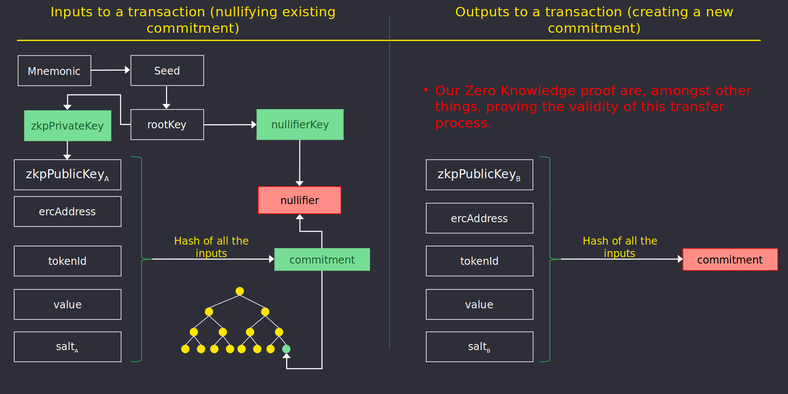

# A ZK-Proof Protocol for Enterprises

Polygon believes in a vision that sees many companies in the near future interacting with each 
other through smart contracts for executing business logic and managing the exchange of goods and services.

In collaboration with [Ernst & Young](https://blockchain.ey.com/), Polygon offers a public, privacy-focused 
Layer 2 rollup solution called Polygon Nightfall to enable accessibility and privacy for companies wanting to 
use Ethereum.

Polygon Nightfall is part of Polygon's suite of scalability solutions, which include 
[Polygon Hermez](https://polygon.technology/solutions/polygon-hermez/), 
[Polygon Miden](https://polygon.technology/solutions/polygon-miden/) 
and [Polygon Zero](https://polygon.technology/solutions/polygon-zero/). 
The key difference is that Nightfall is a privacy-focused rollup designed for enterprise use cases by combining 
the concepts of optimistic rollups and Zero-Knowledge (ZK) cryptography to offer private and scalable transactions.

While Nightfall enables scalability, it is also set to remove a major barrier companies face today 
when using blockchain: the lack of privacy of transactions in public blockchains. Nightfall adds a layer of privacy so that key 
transaction parameters (e.g. value and destination) cannot traceback. These two features have fed the interest 
of private enterprises that see Nightfall as a way to execute their business logic and coordinate with 
their supply chain in a decentralized network at a sustainable price, all while maintaining security and privacy.

## Nightfall's Pillars

Polygon Nightfall's main value proposition is to enable secure, private, low-cost transfers of 
data in a decentralized network.

## Privacy

Polygon Nightfall uses ZK Proofs to send private transactions. A user can generate a ZK Proof of 
the transaction without revealing key transaction parameters such as the destination or the value of the
transaction. More details about the privacy component of Nightfall are available in the
[protocol](../protocol/protocol.md) guide.

## Security

> Nightfall is currently undergoing a security audit, and it is expected to complete in Q3 2022. 
> Once the audit process is complete, the results will be posted here.

> As a new network with a bootstrap period, Nightfall has transitory security measures to 
> protect the system with the objective to remove them and leave it fully decentralized.

Polygon Nightfall is a Layer 2 construction because it leverages Ethereum by borrowing its security as a robust 
public blockchain. Nightfall relies on certain assumptions that guarantee asset recovery. These assumptions are 
based on several design and architectural decisions revolving around ZK-SNARKS. These ZK-SNARKs use 
certain cryptographic primitives, such as hashes and signatures, that make additional security assumptions. 
Finally, Nightfall embeds operating rules in different smart contracts to guarantee that operators don't block 
user transactions and that users can withdraw their assets at all times.

As a summary, Nightfall makes the following security assumptions:

1. Security assumptions of Ethereum.
2. Groth16 assumptions (knowledge of exponent assumption).
3. Certain cryptographic assumptions from primitives such as hashes and signatures.
4. Software security assumptions that rely on correct design and implementation.

## Efficiency

Block proposers collect transactions from various users and batch them together into an L2 Block. 
Typical L2 block sizes contain up to 32 transactions.

The expected gas costs for a deposit, single transfer, double transfer, and withdrawal are 8200, 11400, 
12200, 8500 respectively. This cost is due to store 634Bytes of calldata per transaction, plus some 
fixed calldata and computation to process an L2 block. Costs will be up to 80% lower after 
[EIP 4488](https://eips.ethereum.org/EIPS/eip-4488).

## Non-deniable Transfers

As part of the transfer transaction ZK Proof, Nightfall includes encrypting the secrets (token address, 
value, id, and salt) required to process the transferred commitment. This forces the transmitter to correctly encrypt the secrets 
with a key known to the recipient, thus removing plausible deniability of receiving an incorrectly encrypted commitment.

## Decentralization

Proposers and Challengers are an integral part of Nightfall. They ensure that 
transactions and L2 blocks produce timely and correctly. A proof-of-stake (PoS) based consensus mechanism is 
used to select the next [Proposer](../protocol/proposers.md) of the network. On the other hand, [Challengers](../protocol/challengers.md) monitor the correct operation of the network by raising challenges when an incorrect block is detected and by retaining the 
stake advanced by the Proposer.

## References

1. [A Multi-Sided Approach to ZK Scaling](https://messari.io/article/polygon-a-multi-sided-approach-to-zk-scaling)
2. [Paul's Brody view on Nightfall](https://www.linkedin.com/pulse/say-hello-nightfall-paul-brody-1f/)
