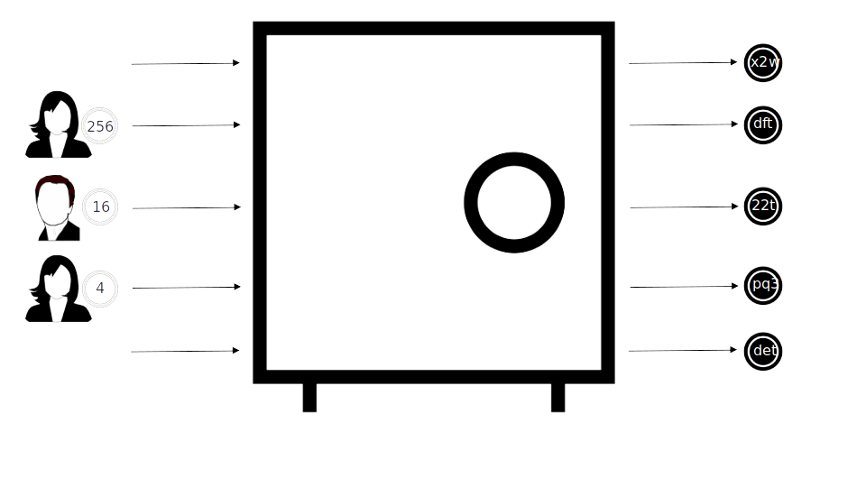
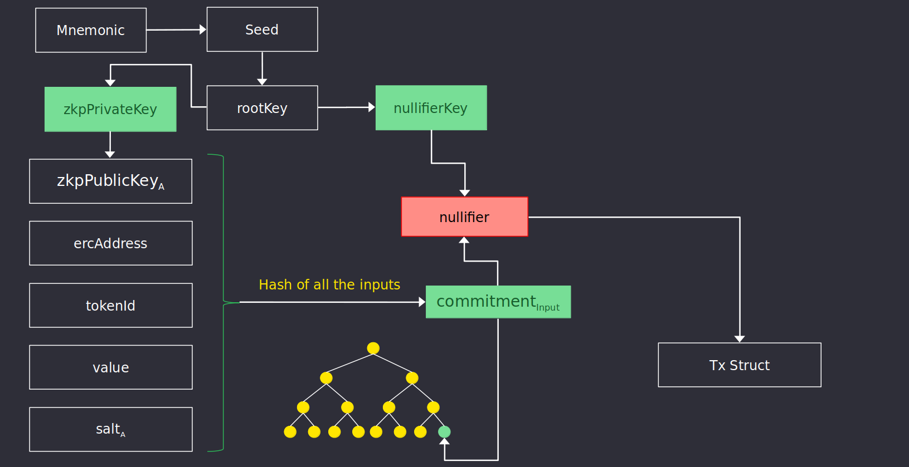
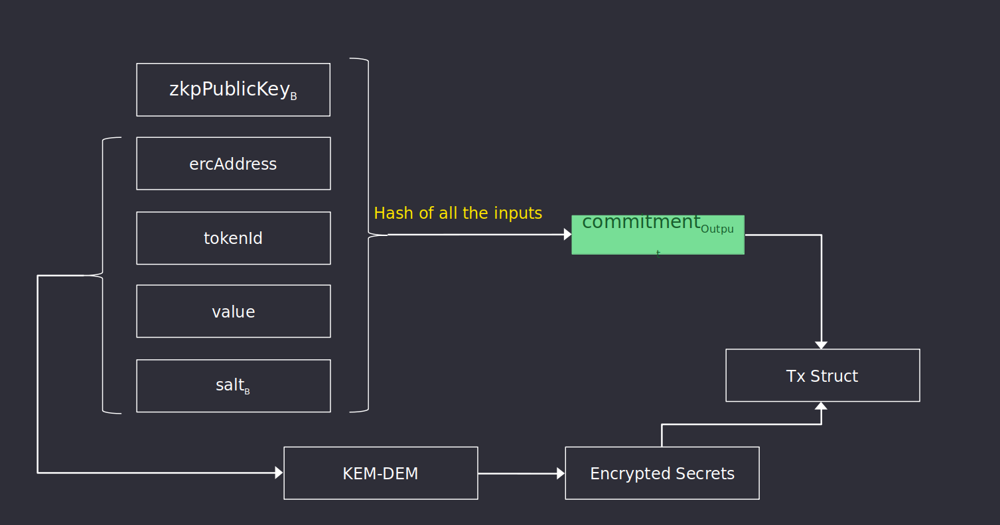
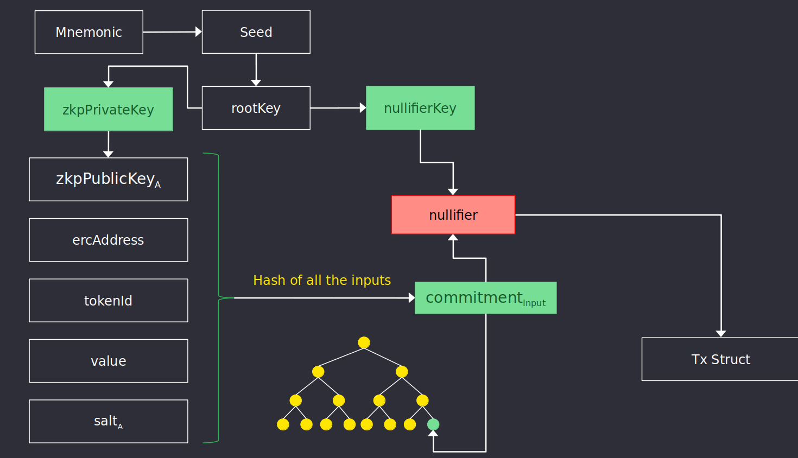

Circuits are used to define the rules that a transaction must follow to be considered correct. There are broadly three types of circuits, one for each type of transaction:

- [Deposit](#deposit)
- [Transfer](#transfer)
- [Withdraw](#withdraw)

Every transaction includes a ZK Proof following the constraints specified in these circuits. Users construct this proof using a Wallet,
or through a Client server.
A proof is generated only if all the following cases are true:

- New [commitment](./commitments#what-are-commitments) is valid
- Old [commitment](./commitments#what-are-commitments) is valid and owned by the sender
- [Nullifier](./commitments#what-are-nullifiers) is valid 
- Merkle Tree path / root is valid
- Ciphertext containing commitment is valid

## Deposit
Deposits convert publicly visible ERC tokens into a token commitment that holds the same value or token id as that of the original token,
and the Nightfall public key of the intended commitment owner. 

A Deposit ZK Proof proves that the prover has created a valid commitment $Z_A$ with a public key $pk_A$. 

The circuit then checks that $Z_A$ == H(@ | ɑ | $pk_A$ | σ)
Leaked information of a deposit transaction include the address that minted the new commitment and the address and value of the ERC token being used.

## Transfer
Transfers enable the transmission of up two commitments of the same asset between two parties by nullifying the previous commitments and creating up totwo new commitments:
- One will be sent to the receiver, containing the value of the transferred ammount
- Another will be created with the value of the change (difference between sum of values of commitments used minus value transferred) and owned by the transmitter.

A Transfer ZK Proof proves that the prover has nullified up to two old commitments which existed in the Merkle Tree, created one new ones, and encrypted its information for the recipient.

In either case, the information leaked will be that an Ethereum address has nullified commitments
amongst the commitment pool owned by the transmitter, and that new commitments have been created.
Information on the new owner, which commitments were spent or the amount transferred remains private.

First diagram goes over the steps around nullifying an existing commitment (or commitments) and adding the information to the `transaction` data structure. 

Second diagram goes over the steps required to generate and encrypt the newly created commitment.

## Withdraw
Withdraw is the operation of nullifying an existing Nightfall commitment and converting it into publicly visible ERC tokens with the same value and token Id as the burnt commitment. Withdraw is the opposite operation to Deposit. Similarly to transferes, withdrawals accept as input up to two commitments.

A Withdraw ZK Proof proves that the prover has nullified up to two old commitment which existed in the MerkleTree. 

Information leaked during a withdrawal includes the address of the address that withdrew the commitment and the value/token Id and address of the token withdrawn.

### Cooling off period

Withdrawals require a `COOLING OFF` period of one week to finalize. This is due to the optimistic nature of Nightfall, since a new block is assumed to be correct until some challenger submits a fraud proof. The funds are held until one week has passed and they can be withdrawn to L1. 

# Fees

Proposer takes incoming transaction and rolls them into a L2 block in exchange for a fee. There are two different types of fees paid to the propose depending on the transaction:
- Deposits pay fees ETH directly in L1. 
- Transfers and Withdrawals pay fees in MATIC in L2. 
