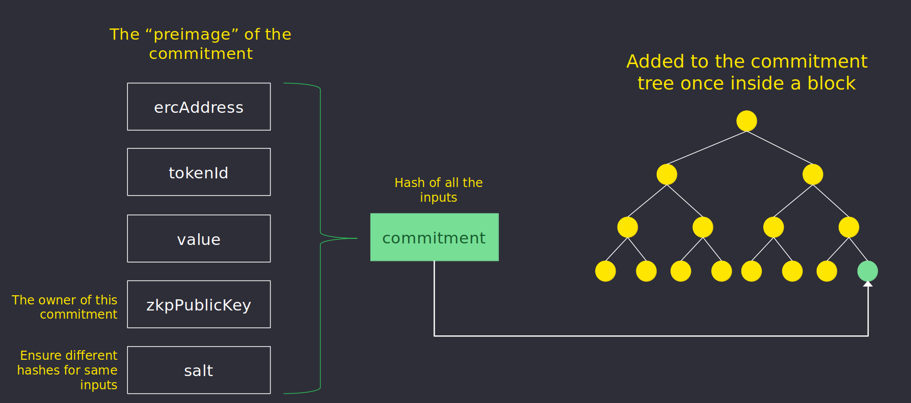
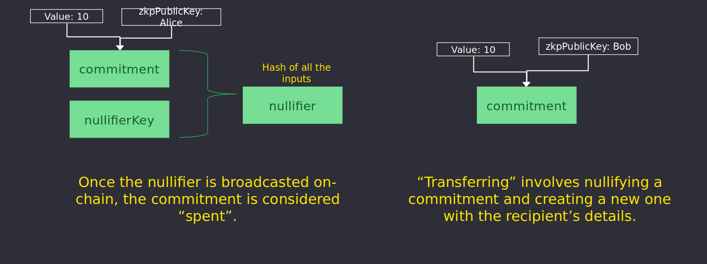

## What are Commitments?
A commitment is a cryptographic primitive that allows a user to commit to a chosen value 
while keeping it hidden to others, with the ability to reveal the committed value later. 
Confidentiality of value and recipient is attained in this manner.

Every time a user performs a transaction using Nightfall, the browser wallet computes a Zero 
Knowledge Proof (ZKP) and creates (or nullifies) a commitment. 
For instance, you create a commitment when you make a deposit or a transfer and nullify a commitment when you 
make a transfer or a withdrawal.

ZKP computation relies on [circuits](../protocol/circuits.md) that define the rules which a 
transaction must follow to be correct. 

The commitment is uses to hide the following properties:
- **ERC address of the token**
- **Token Id**
- **Value**
- **Owner**

Commitments are stored in a *Merkle Tree* structure. The root of this *Merkle Tree* is stored on-chain.

### UTXO
Commitments are created during deposits and transfers, and are spent during transfers and withdrawals transactions. **Commitments are not aggregated together**. When spending a commitment, the value of the commitment spent is limited to the value of up to any two commitnents owned. 

Current ZKP transfer and withdraw circuits used in Nightfall are restricted to 2 input - 2 output (transfer/withdraw commitment and change) excluding payments.
If a transactor's set of commitments contain primarily low value commitments (dust), they may find it hard to conduct future transfers.

Observe the following value sets 

- **Set A**: [1, 1, 1, 1, 1, 1]
- **Set B**: [2, 2, 2]
- **Set C**: [2, 4]

While all three sets have equivalent total sums, the maximum value transfer that can be transacted by sets *A*, *B*, and *C* are 2, 4, and 6 respectively. This is one of the reasons why large commitments values are preferred. The commitment selection strategy used mitigates this risk by prioritising the use of small value commitments while also minimising the creation of dust commitments.

## What are Nullifiers?
A **Nullifier** is the result of combination of a commitment and the nullifier key. Once the nullifier is broadcasted on-chain, the commitment is considered spent.
Nullifiers are stored on-chain as part of the call data during block proposal.

