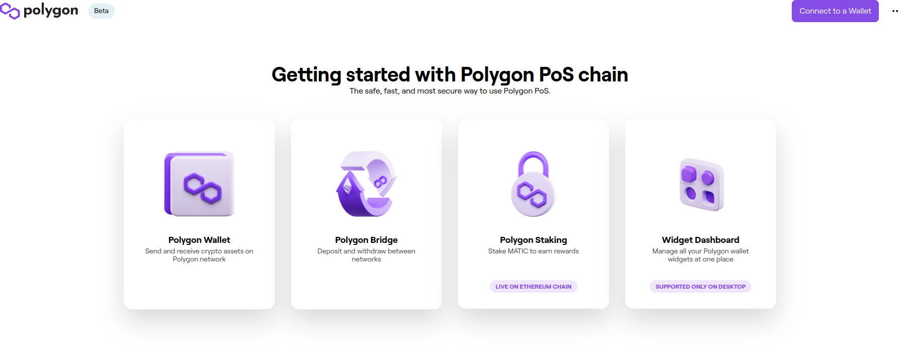
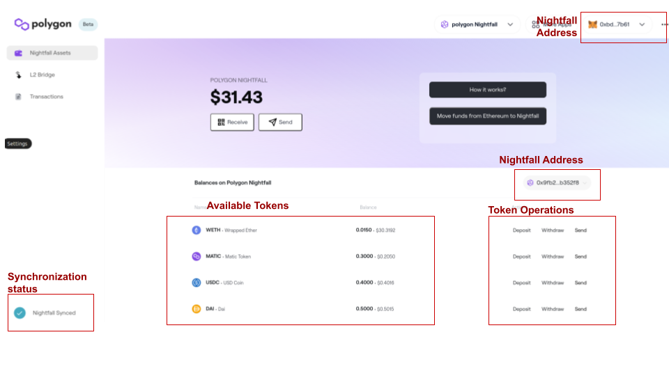
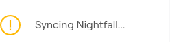
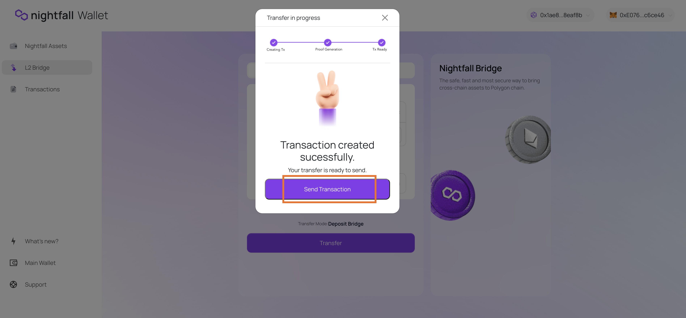

The Polygon Nightfall wallet is a browser wallet that is able to interact with the
Nightfall mainnet beta release.

:::note Use the Nightfall wallet to make deposits, transfers, and withdrawals

The following tokens are currently operative:

- MATIC
- WETH
- DAI
- USDC

### Note the following deposit and withdrawal restrictions:

| ERC20 token | Max Deposit | Max Withdraw |
|-------------|-------------|--------------|
| MATIC       | 250 MATIC   | 1000 MATIC   |
| WETH        | 0.25 WETH   | 1 WETH       |
| DAI         | 250 DAI     | 1000 DAI     |
| USDT        | 250 USDT    | 1000 USDT    |
| USDC        | 250 USDC    | 1000 USDC    |

:::

:::caution Security measures

The Nightfall wallet is tested on a Chrome browser. During Beta, mileage may vary on other 
browsers. 

**We highly recommend you to use Nightfall on Chrome**.

Your wallet keys and transactions are stored in the browser (IndexedDb). 
This data is currently not exported anywhere for security measures. As a result, you will not 
have access to your wallet when using a different browser or a different machine unless you transfer 
the IndexedDB contents, or recover your account.

We may change this in future depending on the Beta phase feedback.

:::

## How to connect a Ledger Hardware Wallet to Nightfall
There is a guide to connect your Ledger Hardware Wallet with Metamask in the official Metamask site [here](https://support.ledger.com/hc/en-us/articles/4404366864657-How-to-access-your-Ledger-Ethereum-ETH-account-via-Metamask?docs=true).

Be sure to connect the Ehtereum App in your wallet and enable "blind signing" in the Ethereum App settings.

## What are Commitments?

A commitment is a cryptographic primitive that allows a user to commit to a chosen value 
while keeping it hidden to others, with the ability to reveal the committed value later.

Every time a user performs a transaction using Nightfall, the browser wallet computes a Zero 
Knowledge Proof (ZKP) and creates (or nullifies) a commitment. 
For instance, you create a commitment when you make a deposit and nullify a commitment when you 
make a withdrawal.

ZKP computation relies on [circuits](../protocol/circuits.md) that define the rules which a 
transaction must follow to be correct. During Beta, there are a limited number of rules in place which require you to operate as follows: 

- The Withdraw value must exactly match the amount in one of the commitments owned
- [About transfers](#important-information-about-transfers)

The key takeaway is that Nightfall handles commitments. Commitments are created during deposits and transfers, and are spent during transfers and withdrawals transactions. Even though the wallet shows the aggregated commitment value per asset, **commitments are not aggregated together**. When spending a commitment, its value of the commitment spent needs to match exactly an existing commitment, (`withdraw` and `single transfer`) or must be a linear combination of any two commitments owned (`double transfer`).

## Getting Started

Visit the Polygon web [mainnet wallet](https://wallet-beta.polygon.technology) or 
[testnet wallet](https://wallet.testnet.polygon-nightfall.technology/), connect your MetaMask 
account and select the Polygon Wallet on the left. If you need help with MetaMask, refer to the 
[Polygon documentation on MetaMask](../../develop/metamask/tutorial-metamask.md)

At this point, the wallet will prompt you to Switch to Polygon Network, and a Metamask popup will
request to confirm the switch.

Next, in the top wallet section, click in the Dropdown menu and select `Polygon Nightfall`, and a 
new request to switch to Ethereum Mainnet will appear. Please, accept to switch to Ethereum mainnet 
to operate with Polygon Nightfall.

If you are working on testnet, the wallet URL will immediatelly take you to the landing page of Polygon Nightfall wallet.

On your first visit your Nightfall wallet will have to be created. A pop-up should appear for generating a mnemonic and creating the wallet. Click `Generate Mnemonic`, then `Create Wallet`. **Note that you can only use this wallet on your current device**.

At this point you should be able to see both your Metamask and your Nightfall wallet addresses (top-right).

**Allow a few more minutes to complete wallet setup before start making transactions**.

On the bottom left corner of the wallet, the wallet status will show as `Syncing Nightfall`. In this state, the wallet is retrieving the
ZK circuits and network state required to perform transactions.

Please, wait until wallet status changes to `Nightfall Synced`

### Your wallet address
Get your Nightfall wallet address from the Nightfall Assets page by clicking on `Receive`.

## How to make deposits
From the Nightfall Assets page, click on the `Deposit` button to the right of the chosen asset, or navigate to the L2 Bridge page.

1. Check that Transfer mode is set to `Deposit`
2. Check that the desired token is selected (WETH, MATIC, etc.)
3. Enter the value to be deposited in your Nightfall wallet, click `Transfer`
4. Review the transaction on the pop-up
5. Click `Create Transaction`

A process will kick off to compute the ZKP and prepare the transaction - grant Metamask with access to your account balances. When this ends, click `Send Transaction` - grant Metamask with further permissions for contract interaction.

Go to the Transactions page to [view your deposit](#view-transactions).

### Important information about deposits
- [Deposit amounts are restricted](#note-the-following-deposit-and-withdrawal-restrictions) while in Beta

## How to make transfers
From the Nightfall Assets page, click on the `Send` button to the right of the chosen asset.

1. Enter a valid address existing on the Polygon Nightfall L2
2. Check that the desired token is selected (WETH, MATIC, etc.)
3. Enter the value to be transferred from your Nightfall wallet, click `Continue`

A process will kick off to compute the ZKP and prepare the transaction. When this ends, click `Send Transaction`.

Go to the Transactions page to [view your transfer](#view-transactions).

### Important information about transfers
Current ZKP transfer circuits used in Nightfall restrict transfer amounts to either exactly matching the value of one of 
an existing commitment, or any linear combination of two existing commitments.

To illustrate transfer restrictions with an example, observe the following commitment sets:

- Set A: [1, 1, 1, 1, 1, 1]
- Set B: [2, 2, 2]
- Set C: [2, 4]

While all three sets have equivalent total sums of 6, only the following transfers are available:

- Set A: Any transfer between 0 and 2 (both excluded)
- Set B: Any transfer between 0 and 4 (both excluded)
- Set C: Any transfer between 0 and 6 (both excluded)

To continue with the example, if Alex owns Set C of commitments, available transfers inlcude any amount between 0 and 6, excluding both limit values. If Alex decides to transfer 3.5 to Bob, Alex will end up with a single commitment of 2.5 and Bob will receive a commitment of 3.5 once the block is proposed.

On the other hand, if Alex decides to transfer an amount of 6 to Bob, the ZK proof will fail because there won't be a valid combination of commitments. 

**It is important to note that these values represent commitments owned**, not e.g. deposits. Further information available on the [commitments](../protocol/commitments.md) section of these docs.

## How to make withdrawals
From the Nightfall Assets page, click on the `Withdraw` button to the right of the chosen asset, or navigate to the L2 Bridge page.

1. Check that Transfer mode is set to `Withdraw`
2. Check that the desired token is selected (WETH, MATIC, etc.)
3. Enter the value to be withdrawn from your Nightfall wallet, click on `Transfer`
4. Review the transaction on the pop-up
5. Click `Create Transaction`

A process will kick off to compute the ZKP and prepare the transaction. When this ends, click `Send Transaction`.

Go to the Transactions page to [view your withdrawal](#view-transactions). After the one week finalization period expires, user will
be able to finalize and claim withdrawal amount.

### Important information about withdrawals
- Withdraw value must exactly match the amount in one of the commitments owned (more about [about commitments](#learn-about-commitments))
- Withdrawals have a **one week** finalization period from the moment when the block including the withdraw transaction was created. Once this time period has elapsed, you can finalize the withdrawal to have your funds sent to your Ethereum account.
- [Withdraw amounts are restricted](#note-the-following-deposit-and-withdrawal-restrictions) while in Beta
- Withdrawals are an onchain transaction, and will pay for gas fees during the transaction request and also when withdraw is finalized.

## View transactions
Check the status of your deposits, transfers and withdrawals on the Transactions page. Note that each transaction is processed as soon as there are enough transactions to produce a block or after 6 hours.

