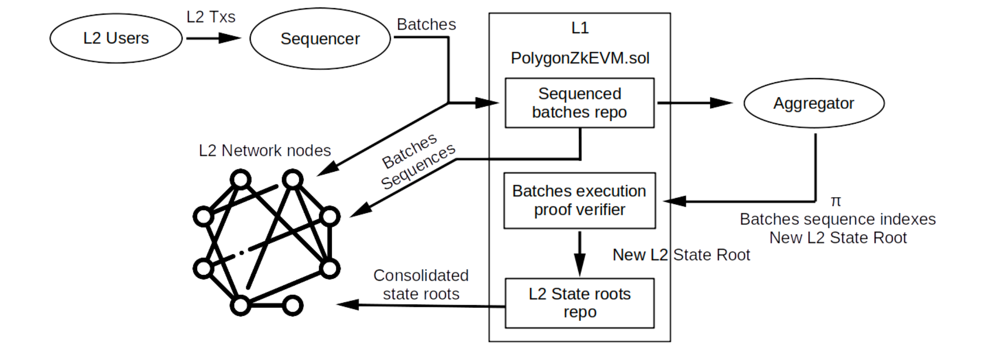
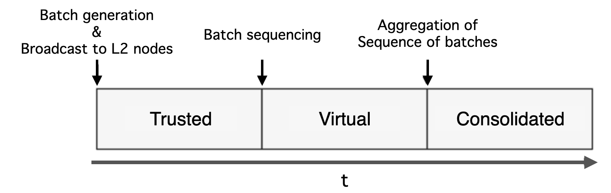

Various **Layer 2 solutions** aimed at improving the **scalability of the Ethereum** network, **primarily transaction throughput**, have been developed over the past years. The ultimate and intended benefit for Ethereum network users is a reduction in gas fees, while maintaining decentralisation and security.

**Polygon zkEVM is a Layer 2 Rollup solution** that combines data availability and **execution verification in Layer 1 of the Ethereum** blockchain to ensure L2 state transition security and reliability.

This section will describe the infrastructure that Polygon designed and implemented for its zkEVM. It aims to explain how the Polygon zkEVM Protocol manages the L2 Rollup's states while providing state transition verifiability and security.

## Components

This section describes the components used in the Polygon zkEVM to enable transaction finality while ensuring the correctness of state transitions.

The three main components of zkEVM protocol are:
- **Trusted Sequencer**
- **Trusted Aggregator**, and
- **Consensus Contract (PolygonZkEVM.sol, deployed on L1)**

### Trusted Sequencer

The Trusted Sequencer component is in charge of **receiving L2 transactions from users, ordering them, generating batches, and submitting them to the Consensus contract's storage slots** in the form of sequences.

The Sequencer executes and broadcasts batches of transactions to L2 network nodes in order to achieve fast finality and reduce costs associated with high network usage. That's before even submitting them to L1.

The Trusted Sequencer must run a zkEVM node in **Sequencer mode** and be in control of an **Consensus Contract-enforced** Ethereum account.

### Trusted Aggregator

The Trusted Aggregator component can **compute the L2 State based on batches of L2 transactions executed by the Trusted Sequencer**.

The main role of the Trusted Aggregator, on the other hand, is to take the L2 batches committed by the Trusted Sequencer and generate Zero-Knowledge proofs attesting to the batches' computational integrity. **These ZK proofs are generated by the Aggregator using a special off-chain EVM interpreter**.

The Consensus Contract's logic validates the Zero-Knowledge proofs, resulting in the zkEVM inheriting the L1 security. **Verification is required before committing new L2 State roots to the Consensus Contract**. A verified proof is an irrefutable evidence that a given sequence of batches led to a specific L2 State.

:::info L2 State Root

An L2 State root is a concise cryptographic digest of the L2 State. In case you want to read more about State roots, please check out [this article](https://ethereum.org/en/developers/docs/scaling/zk-rollups/#state-commitments).

:::

The Trusted Aggregator should run a zkEVM node in **Aggregator mode** and must control a specific Ethereum account enforced in an Consensus Contract.

### PolygonZkEVM.sol

The Consensus Contract used by both the Trusted Sequencer and the Trusted Aggregator in their interactions with L1 is the **PolygonZkEVM.sol** contract.

The Trusted Sequencer can commit batch sequences to L1 and store them in the `PolygonZkEVM.sol` contract, creating a historical repository of sequences.

The `PolygonZkEVM.sol` Contract also **enables the Aggregator to publicly verify transitions from one L2 State root to the next**. The Consensus Contract accomplishes this by validating the Aggregator's ZK-proofs, which attest to the proper execution of transaction batches.

As shown in the above figure, **L2 nodes can receive batch data in three different ways**: 

1. Directly from the Trusted Sequencer before the batches are committed to L1, or
2. Straight from L1 after the batches have been sequenced, or
3. Only after correctness of execution has been proved by the Aggregator and verified by the `PolygonZkEVM.sol` contract.

It is worth noting that **the three batch data formats are received by L2 nodes in the chronological order** listed above.

## Three L2 States

There are three stages of the L2 State, each corresponding to the three different ways in which L2 nodes can update their state. All three cases depend on the format of batch data used to update the L2 State.

In the **first instance**, the update is informed solely by the information (i.e., Batches consisting of ordered transactions) coming directly from the Trusted Sequencer, before any data availability on L1. The resulting L2 state is called the **Trusted State**.

In the **second case**, the update is based on **information retrieved from the L1 network by L2 nodes**. That is, after the batches have been sequenced and data has been made available on L1. The L2 state is referred to as the **Virtual State** at this point.

The information used to update the L2 State in **the last case** includes verified zero-knowledge proofs of computational integrity. That is, **after the Zero-Knowledge proof has been successfully verified in L1, L2 nodes synchronise their local L2 State root** with the one committed in L1 by the Trusted Aggregator. As a result, such an L2 State is known as the **Consolidated State**.

The figure below depicts the timeline of L2 State stages from a batch perspective, as well as the actions that trigger progression from one stage to the next.

## zkEVM Node Execution Modes

**zkEVM node** is a software package containing **all components needed to run zkEVM network**. It can be run in three different modes; **as a Sequencer, an Aggregator, or RPC**.

### Sequencer Mode

In the **Sequencer mode**, the node can do several things some of which are mentioned below:

- hold an instance of the L2 State,
- manage batch broadcasting to other L2 network nodes,
- handle L2 user’s interactions (transaction requests and L2 State queries) via a built-in API,
- temporarily store transactions that have not yet been ordered or executed in a database, which is a pool of pending transactions,
- interact with L1 in order to sequence transaction batches, and keep its local L2 State up-to-date.

### Aggregator Mode

In the **Aggregator mode**, the node has a few capabilities like:

- execute transaction batches,
- compute the resulting L2 State,
- generate the Zero-Knowledge proofs of computational integrity,
- fetch transaction batches committed in L1 by the Trusted Sequencer,
- call the functions needed to verify L2 State transitions publicly, that is on L1.

### RPC Mode

In the **RPC mode**, the zKEVM node has a limited functionality. It primarily **maintains an up-to-date instance of L2 State**, initially with respect to batches broadcast by the Trusted Sequencer, and later with sequences of batches fetched from the Consensus Contract.

The node continuously interacts with L1 in order to keep the local L2 State up to date, as well as to check the synchronization of L2 State roots. The default syncing rate for the synchroniser is every 2 seconds, unless stipulated otherwise in the configuration.
