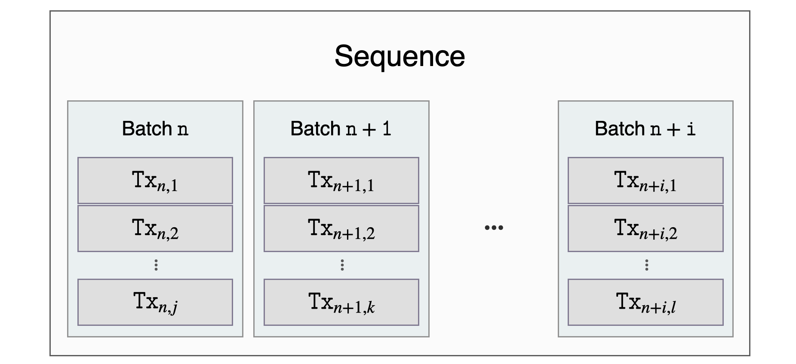
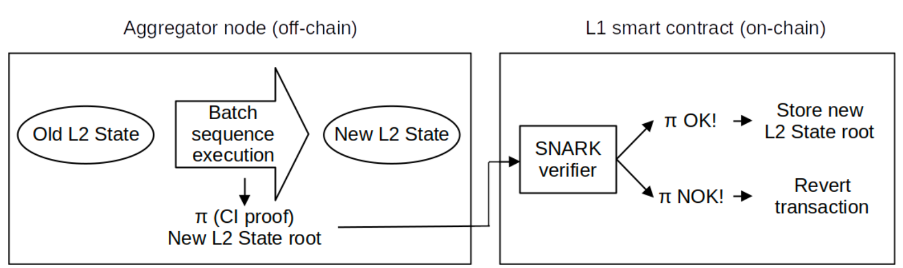

This document describes in detail the various forms and stages that L2 users' transactions go through, from the time they are created in users' wallets to the time they are finally verified with indisputable evidence on L1.

## Submitting Transactions

Transactions in the Polygon zkEVM network are created in users' wallets and signed with their private keys.

Once generated and signed, **the transactions are sent to the Trusted Sequencer's node via their JSON-RPC interface**. The transactions are then stored in the **pending transactions pool**, where they await the Sequencer's selection for execution or discard.

**Users and the zkEVM communicate using JSON-RPC, which is fully compatible with Ethereum RPC**. This approach allows any EVM-compatible application, such as wallet software, to function and feel like actual Ethereum network users.

## Execution & Trusted State

The **Trusted Sequencer reads transactions from the pool** and decides whether to **discard** them or **order and execute** them. Transactions that have been executed are added to a transaction batch, and the Sequencer's local L2 State is updated.

Once a transaction is added to the L2 State, it is broadcast to all other zkEVM nodes via a broadcast service. It is worth noting that **by relying on the Trusted Sequencer, we can achieve quick transaction completion (faster than in L1)**. However, the resulting L2 State will be in a trusted state until the batch is committed in the Consensus Contract.

## Transaction Batching

The Trusted Sequencer must batch the transactions using the following `BatchData` struct specified in the `PolygonZkEVM.sol` contract:

```pil
struct BatchData{
		bytes transactions;
		bytes32 globalExitRoot; uint64 timestamp;
		uint64 minForcedTimestamp;
}
```

#### `transactions`

​These are byte arrays containing the concatenated batch transactions. 

​Each transaction is **encoded according to the Ethereum pre-EIP-115 or EIP-115 formats using RLP (Recursive-length prefix) standard**, but the signature values, `v`, `r` and `s`, are concatenated as shown below;

1. EIP-155: $\mathtt{\ rlp(nonce, gasprice, gasLimit, to, value, data, chainid, 0, 0,) \#v\#r\#s}$ 

2. pre-EIP-155: $\mathtt{\ rlp(nonce, gasprice, gasLimit, to, value, data) \#v\#r\#s }$.

#### `globalExitRoot`

This is the **root of the Bridge's Global Exit Merkle Tree**, which will be synchronized in the L2 State at the start of batch execution.

The Bridge transports assets between L1 and L2, and a claiming transaction unlocks the asset in the destination network.

#### `timestamp`

​In as much as Ethereum blocks have timestamps, **each batch has a timestamp**. 

​There are two constraints each timestamp must satisfy in order to ensure that batches are ordered in time and synchronized with L1 blocks;

1. The timestamp of a given batch must be greater or equal to the timestamp of the last sequenced batch.

2. The maximum batch timestamp a Trusted Sequencer can set to a batch is the timestamp of the block where the sequencing L1 transaction is executed.

#### `minForcedTimestamp`

If a batch is a so-called **forced batch**, this parameter must be greater than zero. Censorship is countered by using forced batches. More on this in the following sections.

## Sequencing & Virtual State

**Batches need to be sequenced and validated** before they can become a part of the L2 Virtual State.

The Trusted Sequencer successfully adds a batch to a sequence of batches using the **L1 PolygonZkEVM.sol** contract's `sequencedBatches` mapping, which is basically **a storage structure that holds the queue of sequences defining the Virtual State**.

```pil
// SequenceBatchNum --> SequencedBatchData

mapping(uint64 => SequencedBatchData) public sequencedBatches;
```

**Batches must be a part of the array of batches to be sequenced** in order to be sequenced. The Trusted Sequencer invokes the **PolygonZkEVM.sol** Contract, which employs its `sequenceBatches` mapping, which accepts an array of batches to be sequenced as an argument. Please see the code snippet provided below.

```pil
function sequenceBatches( 
		BatchData[] memory batches
) public ifNotEmergencyState onlyTrustedSequencer
```

The below figure shows the logic structure of a sequence of batches.



### Max & Min Batch Size Bounds

The contract's public constant, **MAX TRANSACTIONS BYTE LENGTH**, determines the maximum number of transactions that can be included in a batch (300000).

Similarly, the number of batches in a sequence is limited by the contract's public constant **MAX VERIFY BATCHES** (1000). The batches array must contain at least one batch and no more than the value of the constant **MAX VERIFY BATCHES**.

Only the Trusted Sequencer's Ethereum account can access the `sequencedBatches` mapping. It is also necessary that the contract not be in an emergency state.

The **function call will be reverted if the above conditions are not met**.

### Batch Validity & L2 State Integrity

The `sequencedBatches` function iterates over every batch of the sequence, checking its validity. A valid batch must meet the following criteria:

- It must include a `globalExitRoot` value that is present in the **GlobalExitRootMap** of the bridge’s L1 `PolygonZkEVMGlobalExitRoot.sol` contract. **A batch is valid only if it includes a valid `globalExitRoot`.**
- The length of the transactions byte array must be less than the value of **MAX_TRANSACTIONS_BYTE_LENGTH** constant.
- The timestamp of the batch must be greater or equal to that of the last batch sequenced, but less than or equal to the timestamp of the block where the sequencing L1 transaction is executed. **All batches must be ordered by time**.

If one batch is not valid, the transaction reverts, discarding the entire sequence. Otherwise, if all batches to be sequenced are valid, the sequencing process will continue.

A storage variable called `lastBatchSequenced` is used as a batch counter, and it is thus incremented each time a batch is sequenced. It gives a specific index number to each batch that will be used as a position value in the batch chain.

The same hashing mechanism used in blockchains to link one block to the next is used in batches to ensure the cryptographic integrity of the batch chain. That is, including the previous batch's digest among the data used to compute the next batch's digest.

As a result, the digest of a given batch is **an accumulated hash of all previously sequenced batches**, hence the name **accumulated hash** of a batch, denoted by `oldAccInputHash` for the old and `newAccInputHash` for the new.

An accumulated hash of a specific batch has the following structure:

```pil
keccak256( 
		abi.encodePacked(
				bytes32 oldAccInputHash, 
				keccak256(bytes transactions), 
				bytes32 globalExitRoot ,
				uint64 timestamp ,
				address seqAddress
		 )
	)
```

​where,

- `oldAccInputHash` is the accumulated hash of the previous sequenced batch,
- `keccack256(transactions)` is the Keccak digest of the transactions byte array,
- `globalExitRoot` is the root of the Bridge’s Global Exit Merkle Tree,
- `timestamp` is the batch timestamp,
- `seqAddress` is address of Batch sequencer.


As shown in the diagram above, each accumulated input hash ensures the integrity of the current batch's data (i.e., `transactions`, `timestamp`, and `globalExitRoot`, as well as the order in which they were sequenced.

It is important to note that **any change in the batch chain causes all future accumulated input hashes to be incorrect, demonstrating a lack of integrity in the resulting L2 State**.

The batch sequence is added to the `sequencedBatches` mapping using the following `SequencedBatchData` struct only after the validity of all batches in a sequence has been verified and the accumulated hash of each batch has been computed.

```pil
struct SequencedBatchData {
		bytes32 accInputHash;
		uint64 sequencedTimestamp;
		uint64 previousLastBatchSequenced;
}
```

​where,

- `accInputHash` is the batch’s a unique cryptographic finger-print of the last batch in the sequence,
- `sequencedTimestamp` is the timestamp of the block where the sequencing L1 transaction is executed,
- `previousLastBatchSequenced` is the index of the last sequenced batch before the first batch of the current sequence (i.e., the last batch of the previous sequence).

The index number of the last batch in the sequence is used as key and the `SequencedBatchData` struct is used as value when the sequence will be entered into `sequencedBatches` mapping.

### BatchData Minimal Storage

Since storage operations in L1 are very expensive in terms of gas consumption, it is critical to use it as little as possible. To accomplish this, **storage slots (or mapping entries) are used solely to store a sequence commitment**.

Each mapping entry commits two batch indices.
- last batch of the previous sequence as value of `SequencedBatchData` struct, and 
- last batch of the current sequence as mapping key,

along with the accumulated hash of the last batch in the current sequence and a timestamp.

It is important to note that **only the accumulated hash of the last batch in the sequence is saved**; all others are computed on the fly in order to obtain the last one.

As previously stated, **the hash digest will be a commitment of the entire batch chain**. Batch indices also commit useful information like the number of batches in the sequence and their position in the batch chain. The timestamp anchors the sequence to a specific point in time.

The data availability of the L2 transactions is guaranteed because the data of each batch can be recovered from the calldata of the sequencing transaction, which is not part of the contract storage but is part of the L1 State.

Finally a `SequenceBatches` event will be emitted. 

```pil
event SequenceBatches(uint64 indexed numBatch)
```

Once the batches are successfully sequenced in L1, all zkEVM nodes can sync their local L2 State by fetching the data directly from L1 `PolygonZkEVM.sol` contract, without having to rely on the Trusted Sequencer alone. **This is how the L2 Virtual State is reached**.

## Aggregation & Consolidated State

The **Trusted Aggregator should eventually aggregate the sequences of batches previously committed by the Trusted Sequencer in order to achieve the L2 State final stage**, which is the Consolidated State.

Aggregating a sequence means successfully adding the resulting L2 State root to the `batchNumToStateRoot` mapping in the L1 'PolygonZkEVM.sol' contract. This is a storage structure that contains all of the consolidated L2 State roots, which are keyed by the last batch index of each aggregated sequence of batches.

```pil
// BatchNum --> state root

mapping(uint64 => bytes32) public batchNumToStateRoot;
```

Furthermore, the aggregation implies the successful verification of the Zero-Knowledge proof of the computational integrity of the transaction batches execution.

A **SNARK (Succinct Non-interactive Arguments of Knowledge)** is the underlying Zero-Knowledge proof verification schema. One of its key characteristics is the proof's conciseness and speed of verification.

As a result, the integrity of an exhaustive computation can be verified using a fraction of the computational resources required by the original computation. As a result, by employing a SNARK schema, we can provide on-chain security to exhaustive off-chain computations in a gas-efficient manner.



As shown in the above diagram, the off-chain execution of the batches will suppose an L2 state transition and consequently, a change to a new L2 state root. 

A **computation integrity (CI) proof of the execution is generated by the Aggregator**, and its on-chain verification ensures validity of that resulting L2 state root.

In order to aggregate a sequence of batches, the Trusted Aggregator must call the `trustedVerifyBatches` method:

```pil
function trustedVerifyBatches(
    uint64 	pendingStateNum,
    uint64 	initNumBatch,
    uint64  finalNewBatch,
    bytes32  newLocalExitRoot,
    bytes32  newStateRoot,
    uint256  [2] calldata proofA,
    uint256  [2] [2] calldata proofB,
    uint256  [2] calldata proofC
 ) public onlyTrustedAggregator

```

​where, 

- `pendingStateNum` is the number of state transitions pending to be consolidated, which is set to **0** for as long as the Trusted Aggregator is in operation. The `pendingState` functions as a security measure to be used when L2 state is consolidated by an independent Aggregator.
- `initNumBatch` is the index of the last batch in the last aggregated sequence.
- `finalNewBatch` is the index of the last batch in the sequence being aggreated.
- `newLocalExitRoot` is the root of the Bridge’s L2 Exit Merkle Tree at the end of sequence execution used to compute new Global Exit Root when the sequence is aggregated, and allows bridge claiming transactions to be successfully executed in L1.
- `newStateRoot` is the L2 StateRoot resulting from the execution of the sequence of batches over an older L2 State.
- `proof(A,B and C)` is the Zero-Knowledge proof.

**For a sequence of batches to be successfully aggregated, the following conditions must be met:**

- Aggregation transaction must be sent from the Trusted Aggregator account.
- `initNumBatch` argument must be the index of an already aggregated batch. That is, it must have an L2 State root in `batchNumToStateRoot` mapping.
- `initNumBatch` argument must be less or equal to the last aggregated batch index.
- The sequence to be aggregated must have at least one batch.
- `initNumBatch` and `finalNewBatch` arguments have to be sequenced batches, that is, to be present in the `sequencedBatches` mapping.
- Zero-Knowledge proof of computational integrity must be successfully verified.

The **Executor and the Prover are services of the Aggregator node that execute batches and generate Zero-Knowledge proofs**. We will herein treat them as Ethereum Virtual Machine **black box** interpreters that can:

- execute a sequence of transaction batches on the current L2 state,
- calculate the resulting L2 state root, and
- generate a Zero-Knowledge proof of computational integrity for the execution.

The proving/verification system is designed in such a way that successful proof verification equates to cryptographically proving that executing the given sequence of batches over a Specific L2 State results in an L2 State represented by the `newStateRoot` argument.

The following code snippet is a part of the [`PolygonZkEVM.sol`](https://github.com/0xPolygonHermez/zkevm-contracts/blob/main/contracts/PolygonZkEVM.sol) contract, which shows the Zero-Knowledge proof verification:

```pil
bytes memory snarkHashBytes = getInputSnarkBytes(
	initNumBatch,
	finalNewBatch,
	newLocalExitRoot,
	newStateRoot
);

// Calulate the SNARK input
uint256 inputSnark = uint256(sha256(snarkHashBytes)) % _RFIELD;

// Verify proof
require(
	rollupVerifier.verifyProof(proofA, proofB, proofC, [inputSnark]),
	"ProofOfEfficiency::proveNonDeterministicState: INVALID_PROOF"
	);
```
